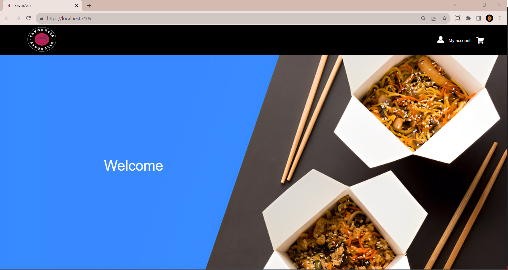

# SavorAsia - Asian Cuisine Ecommerce Website

SavorAsia is a captivating full-stack ecommerce website project developed using ASP.NET. This repository contains the codebase for SavorAsia, an online platform that tantalizes users' taste buds with a diverse range of Asian cuisine offerings. The project not only embraces the essence of a restaurant experience but also seamlessly integrates ecommerce functionalities, making it an ideal playground for aspiring full-stack developers.

## Table of Contents

- [Introduction](#introduction)
- [Features](#features)
- [Installation](#installation)
- [Usage](#usage)
- [Authentication and Authorization](#authentication-and-authorization)
- [Shopping Cart](#shopping-cart)
- [Admin Dashboard](#admin-dashboard)
- [API - SavorAsiaAPI](#savorasiaapi)
- [Contributing](#contributing)
- [License](#license)

## Introduction

Introduce your project here. Discuss the unique blend of Asian cuisine and ecommerce that SavorAsia brings to the table. Highlight the project's significance in terms of enhancing user experiences and learning opportunities.

## Features

Enumerate the distinctive features of SavorAsia. For instance:
- Explore a rich assortment of Asian delicacies.
- Seamlessly add items to your shopping cart for an ecommerce-like experience.
- Robust authentication system with role-based access control.
- Admin users can manage products, orders, and customer interactions.

## Installation

Offer step-by-step guidance on setting up and configuring the project locally. Specify any prerequisites, dependencies, or instructions necessary for a successful installation.

## Usage

Elaborate on how users can interact with the application. Provide clear instructions on browsing items, adding them to the shopping cart, placing orders, and any other relevant interactions.

## Authentication and Authorization

Detail the implementation of the authentication and authorization mechanisms in the project. Clarify how different user roles (customers and admins) are granted varying levels of access.

## Shopping Cart

Explain the functionality of the shopping cart feature. Describe how users can curate their orders, review their selections, and complete the ordering process.

## Admin Dashboard

Illustrate the admin dashboard's capabilities. Highlight administrative tasks such as managing products, processing orders, and overseeing customer interactions.

## API - SavorAsiaAPI

If applicable, provide information about the associated API (SavorAsiaAPI). Describe the API endpoints and their respective functionalities.

## Contributing

Lay out guidelines for potential contributors. Outline the steps to set up a development environment, propose changes, and submit contributions.

## License

Specify the licensing terms for your project. Indicate the type of license under which your project is distributed and any relevant stipulations.

---

Feel free to adapt and expand each section to align with the specifics of your SavorAsia project. Best of luck with your SavorAsia project!

